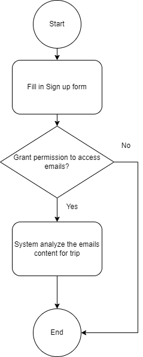
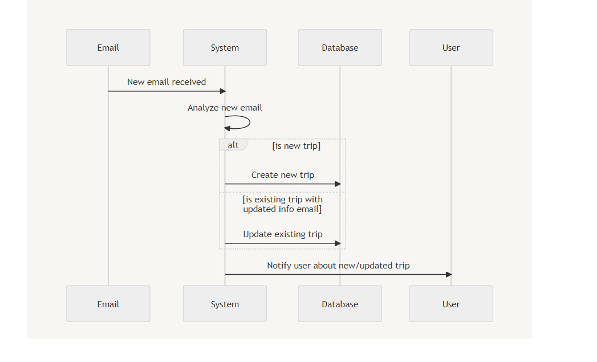
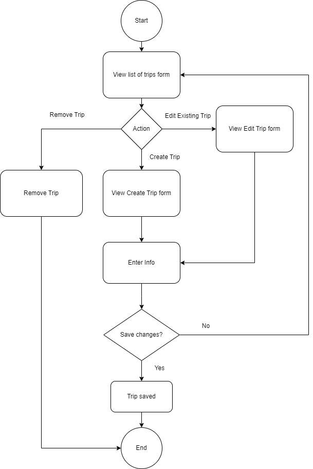
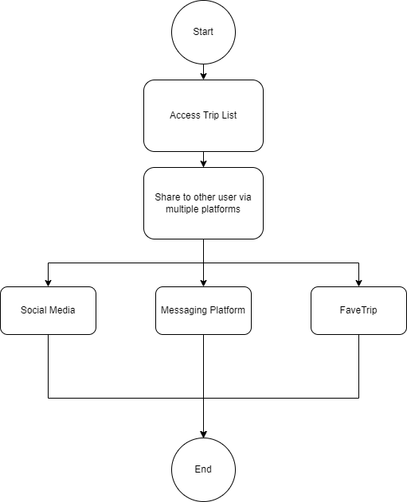

# Road Warriors: Road Warrior Architecture Proposal

## Context

In today's increasingly complex travel landscape, travelers are faced with the challenge of managing reservations scattered across various platforms and emails. Whether planning business trips or leisure vacations, the lack of a centralized and user-friendly solution for organizing travel itineraries has become a significant pain point.

A new startup dedicated to build the next generation online trip management dashboard, **Road Warrior** which aims to empower travelers by offering a unified platform accessible via web or mobile devices, streamlining the management of all travel reservations and revolutionizing the way individuals and businesses organize their trips.

## Requirements

### Business Goals

As stated in the given [requirements](problems/requirements.md), below are the primary business goals targeted for the **Road Warrior**:

- Allow travelers to view all their trip related reservations details in a unified dashboard which extract from various sources:
  - Email
  - Self input details
  - Integrated Agency System (Airline, Hotel, Car Rental)
  - Integrated Travel System (SABRE, APOLLO)
- Allow travelers to manage their existing trip related reservations from the dashboard
- Allow travelers to get near real-time updates regarding their trip related reservations
- Provide meaningful insights to travelers and any interested parties by gathering the analytical data derived from travelers' trips details

### Business Requirements

We proposed to start the implementation with a Minimum Viable Product (MVP) and then iterating over it in later phases, so that we can build a functional system that meets the core requirements and improve incrementally based evolving business needs.

Below is the suggested roadmap for implementing **Road Warrior** from short to long term timelines:

#### Short Term

- Basic user authentication for traveler to sign up and login to the system
- Allow travelers to manually add, update, or delete travel reservations from the dashboard
- Poll and filter travel-related emails (flight details, hotel reservations, and car rentals) from a traveler's email inbox
- Create a simple dashboard that displays travel information which can be view from both web & mobile applications
- Show real-time travel updates to travelers from integrated agency system

#### Mid Term

- Enhance the dashboard to group items by trips and remove completed trip items automatically
- Integrate 3rd party travel system to capture traveler's reservations
- Integrate with prefered travel agency for quick problem resolution
- Share trip information on social media or with specific individuals

#### Long Term

- Generate more in-depth analytics with the power of AI
- Generate end-of-year summary reports for travelers with a wide range of travel metrics
- Internationalization support for users across the world

### Business Constraints

- Initial funding for the project was secured by numerous investors to kickstart the MVP
- The project is expected to sustain mainly with revenue generated from user subcription model in the long run, but not limited to other possible revenue model like providing data insights report

### Technical Constraints

This is a build from scratch project. We have the freedom to choose the technology stack that best fit the requirements and constraints of the project.

## Solution

### Actors, Actions and Significant Scenarios

A actor/actions approach was used to map the requirements to components that help to manage and track user and user actions within the system, and facilitate further analysis of the architecture characteristics.

#### Actors & Actions

Here are the actors and their corresponding actions involved in the Road Warrior system.

| Actors   | Actions                                                                                                                                                                                                                                                                                                                                                        |
| -------- | -------------------------------------------------------------------------------------------------------------------------------------------------------------------------------------------------------------------------------------------------------------------------------------------------------------------------------------------------------------- |
| Traveler | - sign up & login to the system - add new travel reservation - update & delete the existing travel reservations - view all the captured travel reservations in a unified dashboard - view end-of-year travel usage summary reports - view real-time travel updates - share trip information on social media or other users within the system |
| System   | - poll & filter emails to capture travel related reservations - pull travel updates from integrated agency or travel systems - group travel reservations by locations & time - archive completed travel reservations - analyze trip details gathered from travelers                                                                                |

#### Significant Scenarios

Below are the most architecturally significant scenarios derived from the Actors and Actions above, which will shape the architecture of the Road Warrior system.

##### Travel Reservation Capture

- Capture from Email

- Capture from User input

##### Share Trip Details

##### Travel Reservation Updates Tracker

- Track from Integrated Agency System
- Track from Travelers Travel System

##### Travel Reservation Analyzer

- Group travel reservations by locations & time
- Archive completed travel reservations
- Reporting and metrics analytics

### Architecture Analysis

#### Desired Architecture Characteristics

We consider each of the given requirements and map them to corresponsing architecture characteristics below.

- [Performance](/performance.md)
- [Scalability](/scalability.md)
- [Extensibility](/extensibility.md)
- [Availability](/availability.md)
- [Data Consistency](/data_consistency.md)
- [Data Integrity](/data_integrity.md)
- [Usability](/usability.md)

Of course, though we feel all of the above architecture characteristics are important, the 3 of utmost priority to Road Warrior are Performance, Scalabilty, Extensibility.

### Architecture Styles

With the help of the [Architecture Styles Worksheet](https://www.developertoarchitect.com/downloads/architecture-styles-worksheet.pdf) from Mark Richard's website, we compared against few styles to make an informed decision on the architecture style of **Road Warrior** that will give us the most benefits and least trade-offs with respect to the [architecture properties](#desired-architecture-characteristics) mentioned above.

Based on the matrix above, in terms of Scability and Evolvability (Extensibility), both **Microservices** and **Event Driven** architecture do have 5 stars rating which quickly become the obvious candidates for our consideration.

Though the Performance is a downside for **Microservices**, we decided to go for a hybrid architecture style between **Event-Driven & Microservices** (see [ADR-01 Microservice Architecture](/solutions/adrs/01-microservice-architecture.md) and [ADR-02 Event Driven Hybrid Architecture](/solutions/adrs/02-event-driven-hybrid.md)). With this approach, we can best guarantee that **Road Warrior** will able to scale and support the rapidly growing users base, and adapt accordingly to the changing user needs, which we think is a solid foundation for success.

### High Level Architecture

The high level architecture brings together the [Architecture Analysis](#architecture-analysis), with the consideration of the driving characteristics for **Road Warrior**.

As shown in the diagrams above, the application is divided into 4 major components that are loosely coupled.

- Front-end Client
- Infrastructure Abstraction Layer
- API Gateway
- Back-end Microservices

### Detailed Architecture

### ADRs

- [ADR-01 Microservice Architecture](/solutions/adrs/01-microservice-architecture.md)
- [ADR-02 Event Driven Hybrid Architecture](/solutions/adrs/02-event-driven-hybrid.md)
- [ADR-03 Eventual Consistency](/solutions/adrs/03-eventual-consistency.md)

### References

- [Previous Katas Entries](https://github.com/tekiegirl/SoftwareArchitectureResources/blob/main/Resources/OReillyKata.md)
- [Fundamentals of Software Architecture](https://learning.oreilly.com/library/view/fundamentals-of-software/9781492043447/)
- [Building Event-Driven Microservices](https://learning.oreilly.com/library/view/building-event-driven-microservices/9781492057888/)
