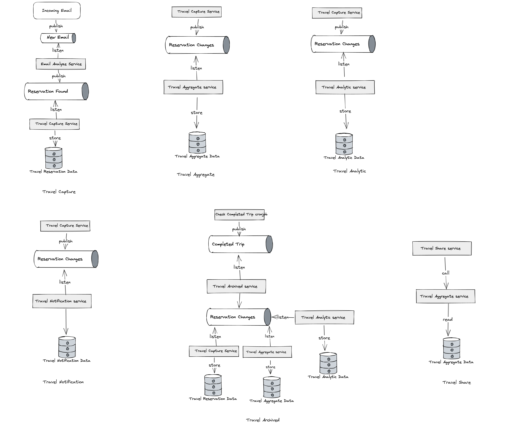

# Travel Services

These are the services that would be applicable to the Travel component of Road Warriors.

## Status

Accepted

## Context

To fufill the multiple needs of the Road Warrior startup, we have devised several services that can be used to provide the necessary functionalities for the Travel component.

### Travel Capture

The Travel Capture service is responsible for capturing travel data from the customer through emails. This service listens to the Email Analyze Service that parses emails and extracts the necessary data from the email. The extracted data is stored as Travel Reservation Data and Broadcasted from the Travel Capture Service.

### Travel Aggregate

The Travel Aggregae Service picks up Reservation Changes broadcasts and aggregates them into a single Travel Reservation. The Travel Aggregate Service also listens to the Travel Notification Service to receive notifications about the Travel Reservation.

### Travel Analytic

The Travel Analytic Service analyses usage of the Road Warrior app to provide insights to the Road Warrior team. The Travel Analytic Service listens to the Reservation Change broadcasts to update information on Travel Reservations.

### Travel Notification

The Travel Notification Service uses a Event Driven Architecture to notify the user of changes to their Travel Reservation. The Travel Notification Service listens to the Reservation Change broadcasts to update information on Travel Reservations. It then sends out notifications based on business requirements and platforms.

### Travel Archival

The Travel Archival subscribes to a Completed Trip broadcast done by a Completed Trip scheduled task that checks on Travel "completion" as set by business requirements.

It broadcasts the **Reservation Changes** notifier for Travel Analytic Service, Travel Capture Service, and Travel Aggregate Service.

### Travel Share

The Travel Share service calls on the Travel Aggregate Service to read data about travels to be shared on external platforms.

## Decision

These are the planned microservices to fulfill the needs of Road Warriors.

## Consequences

### Pros

The microservices are designed to be modular and independent of each other to allow for easy maintenance and scalability.

### Cons

The microservice architecture has more overhead in terms of development and maintenance.
